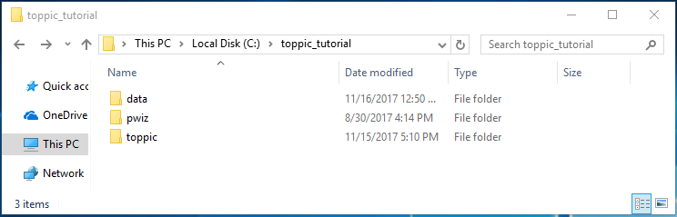
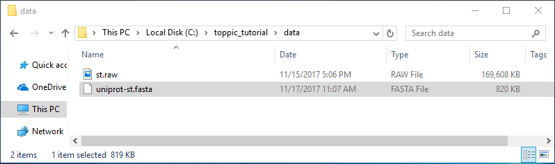
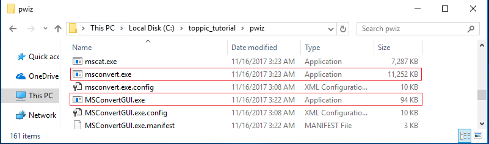
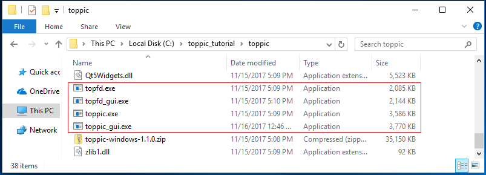
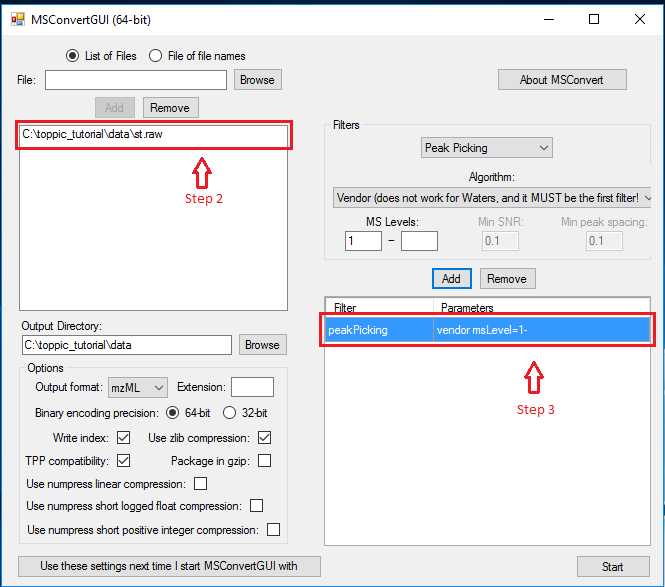
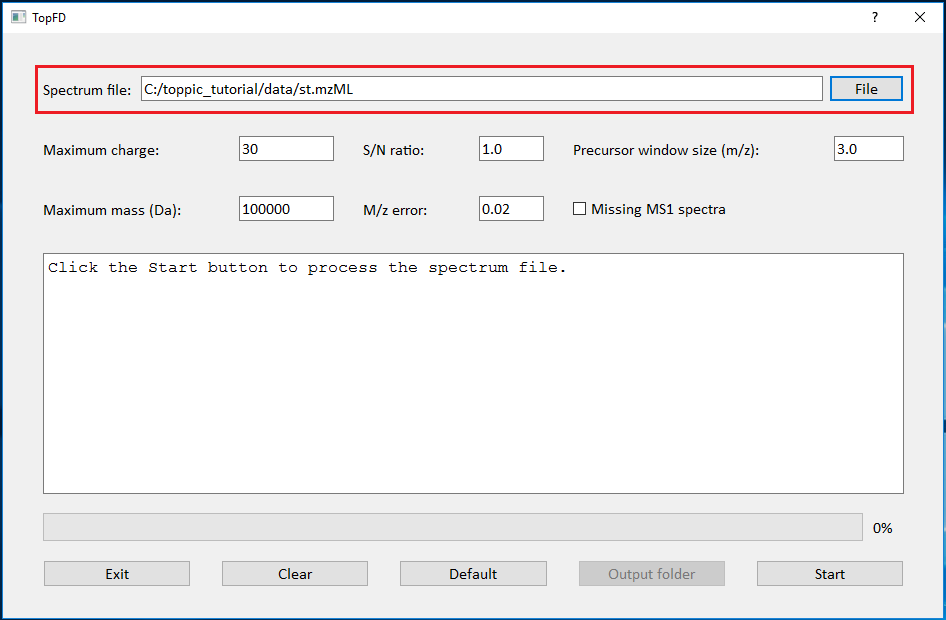
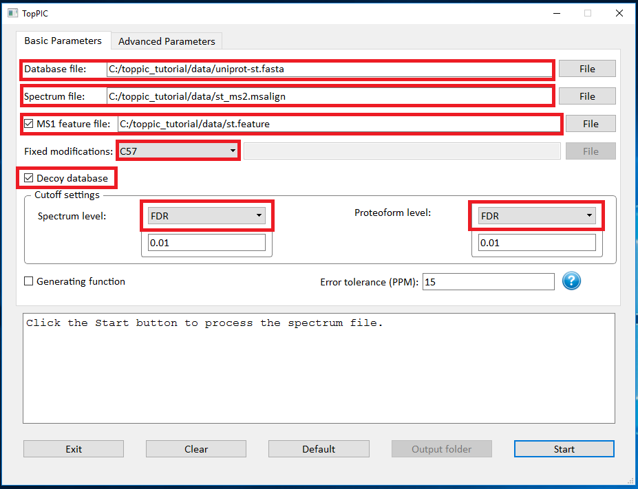

# Overview

In this tutorial, we use TopPIC suite to analyze a top-down MS/MS data set of _Salmonella typhimurium_ on a computer with a Windows operating system. TopPIC suite is cross-platform, however, the msconvert to convert vendor-specific MS data file is Windows-only.

# Folders

Create the folders below for software packages and data sets used in this tutorial. 

* Create a new folder named 'toppic_tutorial' on the C: drive of your system.

* Create a new subfolder named 'pwid' in the folder C:\toppic_tutorial\ for the software package ProteoWizard. 

* Create a new subfolder named 'toppic' in the folder C:\toppic_tutorial\ for the software TopPIC suite. 

* Create a new subfolder named 'data' in the folder C:\toppic_tutorial\ for data files. 

* The resulting folder structure is shown in the screenshot below.

# Date set

## Top-down MS/MS date set

A top-down MS/MS data set of _S. typhimurium_ is used in the tutorial. The protein extract of _S. typhimurium_ were reduced with dithiothreitol and alkylated with iodoacetamide. The protein mixture was separated with an HPLC system coupled to an LTQ-Orbitrap mass spectrometer (Thermo Fisher Scientific). MS and MS/MS spectra were collected at a resolution of 60,000 and 30,000, respectively. The data set contains 1,419 collision-induced dissociation (CID) top-down MS/MS spectra.  

Click here to download the data set and save it in the folder C:\toppic_tutorial\data\.

## Protein sequence database

The _S. typhimurium_ proteome database was downloaded from the UniProt database on November 17, 2017. It contains 1,795 protein sequences.

Click here to download the protein database and save it in the folder C:\toppic_tutorial\data\.

The folder C:\toppic_tutorial\data\ is shown in the screenshot below.

# Software tools

## Msconvert

Msconvert is a software tool in ProteoWizard that converts raw files into various spectrum file formats. 

### Required software packages to install ProteoWizard

You must install the following three software packages to use ProteoWizard
* Visual C++ 2008 SP1 (x86) Redistributable Package

* Microsoft .NET Framework 3.5 SP1

* Microsoft .NET Framework 4.0

### Download ProteoWizard</h4>

Follow the steps to below download ProteoWizard:

Go to the [ProteoWizard website](http://proteowizard.sourceforge.net/downloads.shtml)

* Choose the download type 'Windows 64-bit tar.bz2' for end users.

* Click the button "I agree to the licensing terms, download ProteoWizard" to download ProteoWizard and save the bz2 file in the folder C:\toppic_tutorial\pwid\

* Extract all the files of the downloaded bz2 file to the folder C:\toppic_tutorial\pwiz\

## TopPIC suite

### Download TopPIC suite

* Go to the download webpage of TopPIC.

* Choose the download type "Windows 64-bit zip file," fill out the registration form, and click "I accept license agreement and download TopPIC suite" to download it.

* Save it to the folder C:\toppic_tutorial\toppic\

* Extract all the files of the downloaded zip file to the folder C:\toppic_tutorial\toppic\

# Data analysis using GUI

## File format conversion

We use **MSConvertGUI** to convert the raw file st.raw to an mzML file.

* Double click the executable file MSConvertGUI.exe in the folder C:\toppic_tutorial\pwiz

* Add the file c:\toppic_tutorial\data\st.raw as an input file.

* Add the filter "peakPeaking vendor msLevel=1-"

* Click to the button "Start" to perform file format conversion.

The screenshot of MSConvertGUI is shown below. 

In the above file format conversion, the peak picking filter (step 3) is used to generate a centroid, not profile, mzML data file, which is required by the spectral deconvolution tool TopFD. 

The resulting output mzML file is `C:\toppic_tutorial\result\st.mzML`. The size of the file is about 43 MB, which can be downloaded here.
The running time for the file format conversion is less than one minute.   

## Mass spectral deconvolution

We use **topfd_gui** for top-down mass spectral deconvolution.

* Double click the executable file topfd_gui.exe in the folder C:\toppic_tutorial\toppic

* Add the file c:\toppic_tutorial\data\st.mzML as an input file.

* Click to the button "Start" to deconvolute the file.

The screenshot of topfd_gui is shown below.

TopFD reports three text files:

* A msalign file containing deconvoluted MS1 spectra: `C:\toppic_tutorial\data\st_ms1.msalign`

* A msalign file containing deconvoluted MS/MS spectra: `C:\toppic_tutorial\data\st_ms2.msalign`

* A text file containing LC/MS features of MS/MS spectra: `C:\toppic_tutorial\data\st.feature`

The running time of TopFD is about 6 minutes. 

## Mass spectral identification by database search

We use **toppic_gui** to search MS/MS spectra in the file `st_ms2.msalign` against the protein database `uniprot-st.fasta` to identify PrSMs.

* Double click the executable file toppic_gui.exe in the folder `C:\toppic_tutorial\toppic`

* Select `C:\toppic_tutorial\data\uniprot-st.fasta` as the protein database file.

* Select `C:\toppic_tutorial\data\st_ms2.msalign` as the mass spectrum data file.

* Check the checkbox `MS1 feature file` and select `C:\toppic_tutorial\data\st.feature` as the feature file.

* Select `C57` as the fixed modification.

* Check the checkbox `Decoy database`.

* Select `FDR` as the spectrum level cutoff type.

* Select `FDR` as the proteoform level cutoff type.

* Click to the button `Start`.

The screenshot of toppic_gui is shown below. 

TopPIC reports two tab delimited text files and a collection of html files for identified proteoforms. 

* A tab delimited text file containing identified PrSMs with a 1% spectrum level FDR: `C:\toppic_tutorial\data\st_ms2.OUTPUT_TABLE`

* A tab delimited text file containing identified proteoforms and their best PrSMs with a 1% proteoform level FDR: `C:\toppic_tutorial\data\st_ms2.FORM_OUTPUT_TABLE`

* A folder containing html files for the annotation of identified PrSMs with a 1% spectrum level FDR: `C:\toppic_tutorial\data\st_ms2_prsm_cutoff_html`

* A folder containing html files for the annotation of identified PrSMs with a 1% proteoform level FDR: `C:\toppic_tutorial\data\st_ms2_proteoform_cutoff_html`

In the analysis, `C57` is selected as the fixed modification because proteins were reduced with dithiothreitol and alkylated with iodoacetamide before the MS experiment. When proteins are not reduced, C0 should be selected. A shuffled decoy database is concatenated to the target database to estimate spectrum level and proteoform level FDRs. All identified PrSMs are first filtered by a 1% spectrum level FDR and the resulting PrSMs are reported in the file `st_ms2.OUTPUT_TABLE`. The proteoforms corresponding to the PrSMs are further filtered using a 1% proteoform level FDR and the resulting proteoforms and their corresponding best PrSMs are reported in the file `st_ms2.FORM_OUTPUT_TABLE`. Microsoft Excel can be used to open these two files. To browse the annotations in the two folders `st_ms2_prsm_cutoff_html` and `st_ms2_proteoform_cutoff_html`, use a web browser (Google Chrome is recommended) to open the file proteins.html. The running time of TopPIC is about 5 minutes. 
